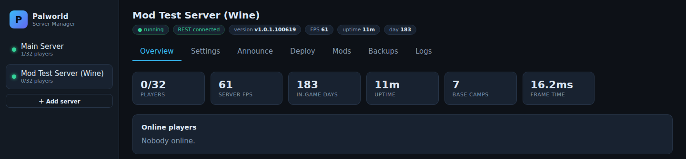
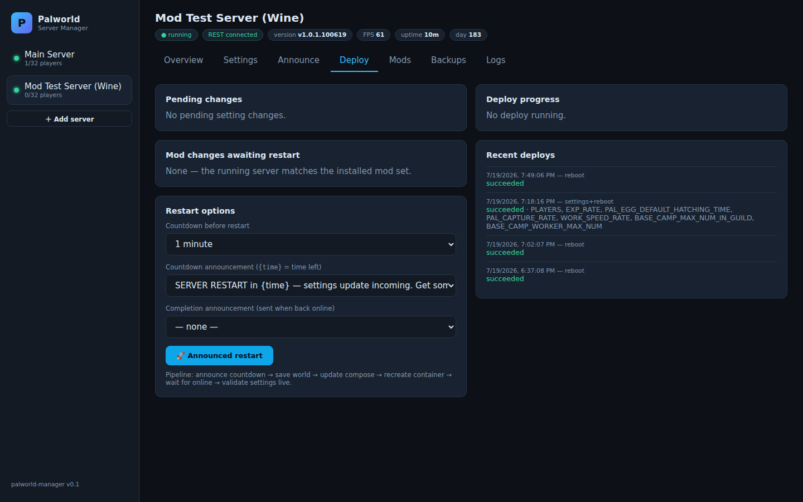

# palworld-docker-wine

**Run a fully moddable Palworld dedicated server on any Linux Docker host.**

This image runs the *Windows* build of the Palworld dedicated server under Wine —
unlocking the official mod system (UE4SS, PalSchema, Lua, and Steam Workshop
mods) that is otherwise Windows-only, while keeping the convenience of Linux
Docker hosting. A full web management UI is included.

> ⚠️ **Deploy and test at your own risk.** This is a community project, not an
> official product. Mods can corrupt saves; Wine adds a compatibility layer to
> a game server that doesn't officially support it. Take backups, test on a
> throwaway world first, and expect rough edges.

## What you get

- 🧩 **Full mod support** — the official Palworld mod system runs and executes:
  UE4SS, PalSchema, Lua and pak mods, installed with one click or one env var
- 🖥️ **Bundled web manager** (port 8220) — dashboard, settings editor,
  announcements, deploy pipeline, backups, world migration, and a built-in
  Steam Workshop mod browser
- ⚙️ **Same env-variable configuration** as the popular
  [thijsvanloef/palworld-server-docker](https://github.com/thijsvanloef/palworld-server-docker)
  image — existing tooling and muscle memory carry over
- 🚀 **Near-native performance** — Wine translates API calls, it doesn't emulate;
  the server runs at full speed and boots in ~30 seconds after first install
- 💾 **Save compatibility** — worlds move freely between this and native Linux
  servers (players keep their characters)

## Screenshots

| Dashboard | Workshop mod browser |
|---|---|
|  |  |



## Quick start

```bash
git clone https://github.com/1tsmejp/palworld-docker-wine.git && cd palworld-docker-wine
# edit docker-compose.yml: set SERVER_PASSWORD, ADMIN_PASSWORD and MANAGER_PASSWORD
docker compose up -d --build
docker logs -f palworld-wine     # first boot downloads ~6 GB via steamcmd
```

- Game: `8211/udp` · REST API: `8212/tcp` (never forward this) · Manager UI:
  [http://localhost:8220](http://localhost:8220) (any username + `MANAGER_PASSWORD`)
- Game server only, no manager: `docker compose up -d palworld-wine`
- Manager first, launch later: `docker compose up -d manager`, then configure
  everything in the UI and press **Launch**

## Installing mods

1. **Manager UI**: Mods tab → sign in to Steam (QR scan with the mobile app; the
   account must own Palworld) → Install → restart from the Deploy tab.
2. **Declarative**: `WORKSHOP_MODS: "3625557007,3761921027"` in the compose env —
   missing mods install at boot; the UI keeps this list in sync.
3. **Manual**: drop a mod with its `Info.json` into `Mods/Workshop/<name>/` and
   add `ActiveModList=<PackageName>` to `Mods/PalModSettings.ini`.

**Important:** UE4SS-, Lua- and PalSchema-type mods need their loader runtimes
installed on the server (clients get them automatically, servers don't):
`UE4SS Experimental (Palworld)` = Workshop ID `3625223587`, `PalSchema` = `3625280368`.
The manager warns when a mod's declared dependencies are missing. Verify
execution in `Pal/Binaries/Win64/Mods/NativeMods/UE4SS/UE4SS.log`.

## Configuration

All world settings use the
[same environment variables](https://github.com/thijsvanloef/palworld-server-docker#environment-variables)
as thijsvanloef's image (`EXP_RATE`, `DEATH_PENALTY`, `PLAYERS`, …), generated
into `PalWorldSettings.ini` at boot. Set `DISABLE_GENERATE_SETTINGS=true` to
manage the INI by hand. Extras: `UPDATE_ON_BOOT` (steamcmd update each start),
`WORKSHOP_MODS` (see above). `USE_BACKUP_SAVE_DATA` must stay `False` under
Wine — back up the `/palworld` volume externally (the manager does this too).

<details>
<summary><b>Technical notes</b> — the Wine specifics baked into this image</summary>

Confirmed working combination (aligned with
[ripps818/docker-palworld-dedicated-server-wine](https://github.com/ripps818/docker-palworld-dedicated-server-wine)):

1. Launch the console build `PalServer-Win64-Shipping-Cmd.exe` — the
   `PalServer.exe` launcher stub hangs under Wine, and the windowed shipping
   exe breaks saves and logins.
2. `winetricks vcrun2022` (real MSVC runtime) — without it the save pipeline
   fails (`Failed to save. Failed copy from backup.`) and players are kicked
   at character creation.
3. WineHQ stable + persistent Xvfb + `-useperfthreads -NoAsyncLoadingThread
   -UseMultithreadForDS`; `winbind` for Steam NTLM auth.
4. steamcmd is native Linux — only the game runs under Wine
   (`@sSteamCmdForcePlatformType windows`, app 2394010).
5. Official mod deploy targets: pak → `Content/Paks/~WorkshopMods/<pkg>/`,
   PalSchema → `Mods/NativeMods/UE4SS/Mods/PalSchema/mods/`, Lua/UE4SS →
   `Mods/NativeMods/UE4SS/Mods/`.
</details>

## Credits

- [thijsvanloef/palworld-server-docker](https://github.com/thijsvanloef/palworld-server-docker) — env convention and settings template
- [ripps818/docker-palworld-dedicated-server-wine](https://github.com/ripps818/docker-palworld-dedicated-server-wine) — proven Wine recipe this image aligns with
- Wine, winetricks, steamcmd, [UE4SS](https://github.com/UE4SS-RE/RE-UE4SS), [PalSchema](https://github.com/Okaetsu/PalSchema)

MIT licensed. Not affiliated with Pocketpair.
